# TechSolutions S.A. de C.V. — Sistema de Gestión de Tareas (Java + Swing + MongoDB)

> Universidad: TecMilenio · Materia: **Estructuras de Datos** · Profesora: **Blanca Aracely Aranda Machorro** · Ubicación: **Monterrey, Nuevo León**
 


Este repositorio contiene una implementación base y la documentación de un **sistema de gestión de tareas** para *TechSolutions S.A. de C.V.* construido en **Java 17**, **Swing**, **MongoDB** y **Maven**. Incluye estructuras de datos (Stack, Queue, PriorityQueue, HashMap, árbol binario y grafo de dependencias) y una organización por capas usando **MVC** + **DAO**.
##  Índice

1. [Caso de Estudio](#caso-de-estudio)  
2. [Problemática identificada](#problemática-identificada)  
3. [Solución propuesta](#solución-propuesta)  
4. [Tecnologías utilizadas](#tecnologías)  
5. [Alcance del sistema](#alcance)  
6. [Roles del sistema](#roles-del-sistema)  
7. [Beneficios esperados](#beneficios)
8. [Diagrama de caso de uso](#DiagramadeCasosdeUso)
9. [Diagrama de flujo](#Diagramadeflujo)
10. [Estructura del proyecto](#estructura-del-proyecto)  
11. [Estructuras de datos aplicadas](#estructuras-de-datos-aplicadas)  
12. [Requisitos Funcionales (RF01–RF09)](#requisitos-funcionales-rf)  
13. [Objetivos de aprendizaje alcanzados](#objetivos-de-aprendizaje-alcanzados)  
14. [Cómo ejecutar (local)](#cómo-ejecutar-local)   
15. [Bibliografía](#bibliografía-selección)  
16. [Autores](#autores-del-entregable-original)  
17. [Licencia](#licencia)  


---

## Caso de Estudio

La empresa, ubicada en Monterrey, tiene varios departamentos (Desarrollo, Ventas, Soporte, Administración). Se detectaron problemas como la dispersión de tareas en hojas de cálculo, falta de priorización y poca visibilidad de dependencias, lo que dio lugar a retrasos y baja productividad.

---

## Problemática identificada

- Falta de priorización clara entre tareas urgentes y programadas.
- Dependencias poco visibles entre tareas.
- Retrasos por búsquedas lentas en listas generales.
- Escasa trazabilidad de empleados y su carga de trabajo.

---

## Solución propuesta

Una aplicación Java (consola/GUI) que gestiona tareas departamentales con **clientes VIP**, **inventario**, **ventas**, **reportes** y **roles**. Se integran estructuras de datos y persistencia en MongoDB bajo el patrón DAO.

---

## Tecnologías
- **Java 17+**
- **Maven**
- **Swing**
- **MongoDB**
- **Estructuras de Datos**: Stack, LinkedList, PriorityQueue, HashMap
- **Patrones**: MVC, DAO, Singleton
---
## Alcance
- Registro/gestión de tareas: ID, descripción, urgencia, fecha límite, departamento.
- Clasificación por estructuras: **Pila** (urgentes), **Cola** (programadas), **Lista** (por departamento), **Cola de Prioridad** (prioridad + fecha).
- Persistencia (CRUD) en MongoDB.
- Reportes básicos y estadísticas simples.
---
## Roles del Sistema
- **Empleado**: registra/consulta sus tareas.
- **Líder de Departamento**: consulta todas las tareas del área y ajusta prioridades.
- **Administrador**: CRUD global de tareas/empleados y configuración de BD.
- **Cliente VIP**: seguimiento prioritario (solo consumo).
---
## Beneficios
Priorización automática, visibilidad de dependencias/jerarquías, búsquedas rápidas, trazabilidad y persistencia de datos.

---
## Diagrama de Casos de Uso 
- Sistema de Gestión de Tareas

```mermaid
flowchart LR
    %% Actores
    U[👤 Usuario]
    A[🛠️ Administrador]

    %% Casos de uso Usuario
    CU1((Crear Tarea))
    CU2((Asignar Tarea))
    CU3((Ver Tareas))
    CU4((Actualizar Tarea))
    CU5((Eliminar Tarea))
    CU6((Detectar Ciclos))
    CU7((Orden Topológico))
    CU8((Reconectar MongoDB))

    %% Casos de uso Administrador
    CA1((Insertar Empleado))
    CA2((Eliminar Empleado))

    %% Relaciones Usuario
    U --> CU1
    U --> CU2
    U --> CU3
    U --> CU4
    U --> CU5
    U --> CU6
    U --> CU7
    U --> CU8

    %% Relaciones Administrador
    A --> CA1
    A --> CA2

    %% Agrupar en sistema
    subgraph Sistema["Sistema de Gestión de Tareas"]
        CU1
        CU2
        CU3
        CU4
        CU5
        CU6
        CU7
        CU8
        CA1
        CA2
    end
```


## 📌 Diagrama de Flujo  - SGT

```mermaid
flowchart TD
    %% Inicio
    A([Inicio]) --> B[Iniciar app / inicializar estructuras / conectar MongoDB]
    B --> C[Configurar UI y cargar datos]

    %% Ciclo principal
    C --> D{Usuario selecciona acción}

    %% Crear
    D -->|Crear| E[Generar ID, crear Tarea, agregar a estructura y guardar en MongoDB]

    %% Ver
    D -->|Ver| F[Mostrar detalles / búsqueda por ID]

    %% Eliminar
    D -->|Eliminar| G[Eliminar de estructura y de MongoDB]

    %% Actualizar
    D -->|Actualizar| H[Editar en memoria y actualizar en MongoDB]

    %% Cerrar
    D -->|Cerrar| I[Usuario cierra la interacción]

    %% Bucle
    E --> J{¿Continuar?}
    F --> J
    G --> J
    H --> J
    I --> J

    J -->|Sí| D
    J -->|No| K[Cerrar conexión MongoDB]

    %% Fin
    K --> L([Fin])
```



## Estructura del proyecto

```
techsolutions-presentacion-github/
├─ .gitignore
├─ LICENSE
├─ pom.xml
├─ README.md
├─ src/
    └── main/java/com/techsolutions/
        ├── db/
        │   └── MongoDBManager.java          // Conexión directa a MongoDB
        │
        ├── gui/
        │   └── PanelPila.java               // Interfaz Swing para mostrar Pila
        │
        ├── model/
        │   ├── ArbolEmpleados.java          // Árbol binario / AVL de empleados
        │   ├── Empleado.java                // Entidad empleado
        │   ├── Tarea.java                   // Entidad tarea
        │   └── TareaPrioridad.java          // Extiende tarea con prioridad
        │
        ├── services/
        │   └── MongoDBService.java          // Lógica de negocio sobre la DB
        │
        ├── util/
        │   ├── GrafoTareas.java             // Grafo para dependencias entre tareas
        │   └── Utilidades.java              // Métodos de ayuda (validaciones, etc.)
        │
        ├── utils/
        │   └── PruebaConexionMongoDB.java   // Clase de prueba de conexión DB
        │
        ├── DatosPredeterminados.java        // Semilla de datos iniciales
        └── SistemaGestionTareas.java        // Clase principal (main)
```

> El contenido base de este README se adaptó desde la presentación original del proyecto del curso. Consulta el documento fuente en la carpeta de la entrega para más detalles.
---
### Estructuras de Datos aplicadas
- **PriorityQueue**: `O(log n)` en inserción/poll, `O(1)` peek.
- **List**: recorrido `O(n)`; índice `O(1)`.
- **HashMap**: `O(1)` promedio en búsqueda/inserción.
- **Grafo**: recorrido `O(V+E)` (DFS para ciclos/dependencias).
- **Árbol Binario** para empleados.
---

### Requisitos Funcionales (RF)
RF01–RF09: registro y clasificación de tareas, búsqueda por ID, empleados en árbol binario, dependencias en grafo y persistencia MongoDB.

---
### Objetivos de Aprendizaje alcanzados
Entorno listo con Maven, conexión a `mongodb://localhost:27017` (BD `techsolutions`), patrones POO/DAO, UI Swing funcional, y verificación con Compass. Diagramas UML y flujo UI ↔ BD verificados.

---

## Cómo ejecutar (local)

1) **Requisitos**
- Java 17+ y Maven instalados en el PATH.
- MongoDB corriendo en `localhost:27017` (o variable `MONGODB_URI`).

2) **Compilar y ejecutar**

```bash
mvn -q -DskipTests package
java -jar target/gestion-tareas-0.1.0.jar
```

> Para lanzar la GUI directamente durante el desarrollo:
```bash
mvn -q exec:java -Dexec.mainClass="com.techsolutions.Main"
```

3) **Variables de entorno opcionales**
- `MONGODB_URI` (por defecto `mongodb://localhost:27017`)
- `MONGO_DB_NAME` (por defecto `techsolutions`)

---

## Bibliografía (selección)
- Oracle. *Java SE Docs*.  
- MongoDB Inc. *MongoDB Manual*.  
- Weiss, M. A. *Data Structures and Algorithm Analysis in Java*.  
- GoF. *Design Patterns*.  
- Fowler. *PEAA*.  
- Deitel & Deitel. *Java: How to Program*.  
- Knuth. *TAOCP Vol.1*.

---

## Autores (del entregable original)


## Licencia
MIT
